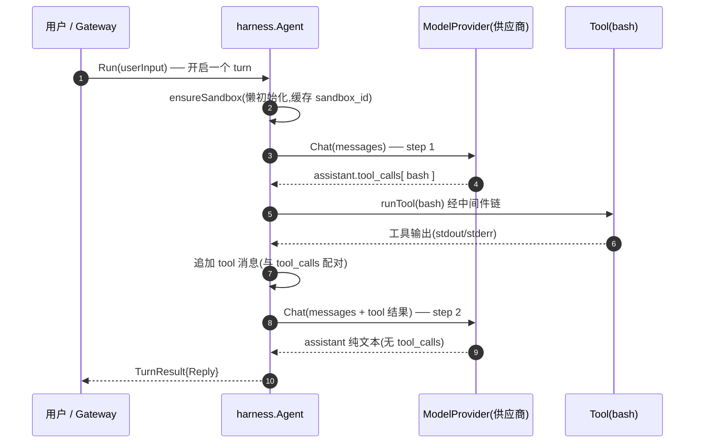
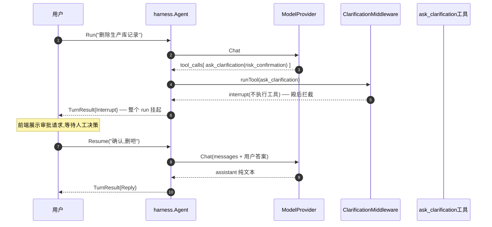
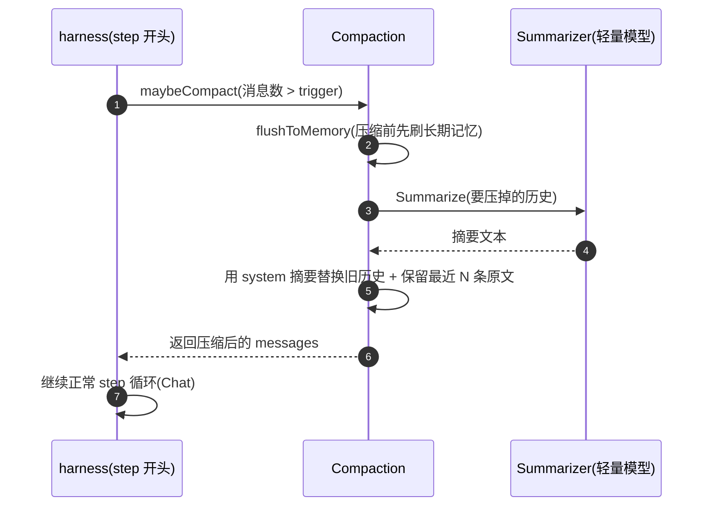
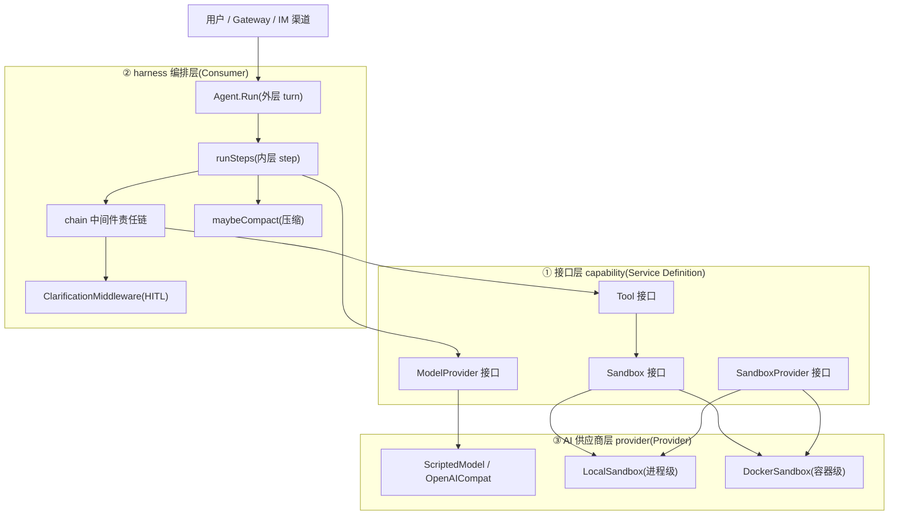

# Go 复现 DeerFlow 核心能力(16 个 · 生产级细节版)

> 把 deer-flow（Python / LangGraph）里的 16 个核心能力，用 Go **不砍生产级细节**地复现。
> 这不是「翻译代码」，而是「翻译设计 + 保留生产级实现」—— 每个能力的每个分支、
> 边界条件、防御性检查都在 Go 里有对应，并标注对应的 deer-flow 源码 `file:line`。
>
> 阅读视角按**三个角色**展开，正好对应 `capability-seam` 的三件套：
> **接口（Service Definition）→ harness（编排 / Consumer）→ AI 供应商（Provider）**。
>
> 源码在 `go-replication/`，可离线编译运行：
> `cd agent-interview-study/go-replication && go build ./... && go test ./...`

## 验证状态(全部通过)

- `gofmt -l .` 干净
- `go build ./...` ✅
- `go vet ./...` ✅
- `go test ./... -count=1` ✅(6 个包,342 个测试用例)
- 逐条源码验证:23 个 `file:line` 锚点全部命中(见文末「源码验证」)

## 能力总览(16 个)

| # | 能力 | Go 文件 | deer-flow 源码 | 关键设计 |
|---|---|---|---|---|
| 1 | capability-seam | `capability/contract.go` + `registry.go` | `sandbox/sandbox.py` + `sandbox_provider.py` | interface + 工厂注册表 = 依赖倒置 |
| 2 | agent-loop | `harness/loop.go` + `agent.go` | `runtime/runs/worker.py` + `manager.py` | turn/step 双层循环 + recursion_limit=100 |
| 3 | human-in-the-loop | `harness/interrupt.go` | `clarification_tool.py` + `clarification_middleware.py` | ask_clarification + 中间件拦截挂起 |
| 4 | context-compaction | `harness/compaction.go` | `summarization_middleware.py` + `summarization_config.py` | trigger/keep 三维度 + 先刷记忆再压缩 |
| 5 | sandbox | `provider/sandbox.go` | `sandbox/local/` + `community/aio_sandbox/` | 两层隔离(local/docker)+ 升级 |
| 6 | state-reducer | `harness/state.go` | `agents/thread_state.py` | 5 个 reducer 并发合并语义 |
| 7 | loop-detection | `harness/loopdetect.go` | `middlewares/loop_detection_middleware.py` | 两层检测(哈希+频率)+ 梯度警告/硬停止 |
| 8 | dangling-tool-call | `harness/dangling.go` | `middlewares/dangling_tool_call_middleware.py` | 补合成 ToolMessage 修协议 |
| 9 | deferred-tool | `capability/deferred.go` | `tools/builtins/tool_search.py` | 目录只给名字,按需取 schema |
| 10 | long-term-memory | `harness/memory.go` | `agents/memory/queue.py` + `storage.py` | 防抖合并 + OR 信号 + 原子写 |
| 11 | sub-agent | `harness/subagent.go` | `subagents/executor.py` + `task_tool.py` | 独立上下文委派 + 信号量限流 |
| 12 | mcp-integration | `mcp/mcp.go` | `mcp/client.py` + `session_pool.py` + `cache.py` + `oauth.py` | 配置翻译 + 会话池 + LRU + OAuth |
| 13 | skills | `skills/skills.go` | `skills/parser.py` + `security_scanner.py` + `tool_policy.py` | frontmatter 解析 + fail-closed 扫描 |
| 14 | model-abstraction | `provider/model.go` | `models/factory.py` + `*_provider.py` | thinking_enabled 归一化方言 |
| 15 | stream-bridge | `runtime/stream.go` | `runtime/stream_bridge/memory.py` | per-run 事件日志 + 重放 + 心跳 |
| 16 | guardrail | `harness/guardrail.go` | `guardrails/middleware.py` + `builtin.py` | 工具执行前鉴权 + fail-closed |

---

## 0. 三个角色：一条依赖倒置的主线

| 角色 | Go 里的形态 | deer-flow 对应 | 目录 |
|---|---|---|---|
| **① 接口层**（Service Definition） | `interface` | `sandbox.py::Sandbox(ABC)`、`SandboxProvider(ABC)`、LangChain `BaseChatModel`/`BaseTool` | `capability/` |
| **② harness 编排层**（Consumer） | 依赖接口的业务逻辑 | `agents/lead_agent/agent.py`、`runtime/runs/worker.py`、19 级 middleware 链 | `harness/` |
| **③ AI 供应商层**（Provider） | 接口实现 + 工厂注册 | `models/*_provider.py`、`sandbox/local`、`community/aio_sandbox` | `provider/` |

**核心洞察（capability-seam 的本质）**：deer-flow 里 `Sandbox` 是个 ABC（抽象基类），
`get_sandbox_provider()` 用 `resolve_class(config.sandbox.use)` 反射实例化具体实现；
`tools.py` 里的 `bash/ls/grep` 只拿到 `Sandbox` 抽象，不关心是本地还是容器。
这就是 Go 里再熟悉不过的「面向接口编程 + 依赖倒置」—— 区别只是：

- Python 用 **ABC + 反射（`resolve_class`）** 在运行时按配置字符串选实现；
- Go 用 **interface + 注册表（`map[name]Factory`）** 在编译期登记、运行时查表实例化。

两者殊途同归：**上层只认名字/抽象，不 import 具体实现**，换来可测试、可替换、可「升级」。

```
           capability(接口)                 harness(编排/Consumer)          provider(供应商)
  ┌──────────────────────────┐      ┌──────────────────────────┐   ┌──────────────────────────┐
  │ type Sandbox interface   │◄─────│ Agent.Run / runSteps      │──▶│ LocalSandbox / Docker     │
  │ type ModelProvider iface │◄─────│ maybeCompact / interrupt  │──▶│ ScriptedModel/OpenAICompat│
  │ type Tool interface      │◄─────│ chain(中间件)              │   │                          │
  └──────────────────────────┘      └──────────────────────────┘   └──────────────────────────┘
       依赖方向:provider → capability ← harness   (都指向接口,谁都不依赖对方)
```

---

## 1. capability-seam（能力三件套）

**deer-flow 源码映射**：

- Service Definition = [`sandbox.py:6`](../backend/packages/harness/deerflow/sandbox/sandbox.py#L6) 的 `Sandbox(ABC)`：声明 `execute_command/read_file/download_file/list_dir/write_file/glob/grep/update_file` 8 个方法，只定契约不写实现。
- Provider = [`sandbox_provider.py:9`](../backend/packages/harness/deerflow/sandbox/sandbox_provider.py#L9) 的 `SandboxProvider(ABC)`（`acquire/get/release/reset` 生命周期）+ [`sandbox_provider.py:60`](../backend/packages/harness/deerflow/sandbox/sandbox_provider.py#L60) 的 `get_sandbox_provider()` 单例 + `resolve_class` 反射。
- Consumer = [`tools.py:1394`](../backend/packages/harness/deerflow/sandbox/tools.py#L1394) 的 `bash_tool` 等，通过 `ensure_sandbox_initialized(runtime)` 拿到 `Sandbox` 再调用。

**Go 复现**（`capability/contract.go` + `capability/registry.go`）：

```go
// ① Service Definition —— 只声明「能做什么」(8 个方法全保留)
type Sandbox interface {
    ID() string
    ExecuteCommand(command string) string        // 失败也返回输出(不崩 run)
    ReadFile(path string) (string, error)
    DownloadFile(path string) ([]byte, error)
    ListDir(path string, maxDepth int) []string  // 目录不存在返回空
    WriteFile(path, content string, appendMode bool) error
    Glob(path, pattern string, includeDirs bool, maxResults int) ([]string, bool, error)
    Grep(path, pattern, glob string, literal, caseSensitive bool, maxResults int) ([]GrepMatch, bool, error)
    UpdateFile(path string, content []byte) error
}

// ② Provider —— 生命周期 + 工厂注册表(对应 resolve_class)
type SandboxProvider interface {
    Acquire(threadID string) (string, error)
    Get(id string) (Sandbox, bool)
    Release(id string)
    Reset()
}
func RegisterSandboxProvider(name string, f SandboxProviderFactory) { /* ... */ }
func NewSandboxProvider(name string) (SandboxProvider, error)       { /* 查表 */ }
```

**生产级细节**：`ExecuteCommand` 返回 `string` 而非 `(string, error)` —— 对应 deer-flow 里
命令失败也返回输出（含 stderr/退出码），让模型看到失败自行判断下一步，而不是让 run 直接崩掉。
`ListDir` 返回 `[]string` 而非 `([]string, error)` —— 目录不存在返回空列表。

---

## 2. agent-loop（turn / step 双层循环）

**deer-flow 源码映射**：

- 外层 **turn** = 一次 `run`，由 [`worker.py:124`](../backend/packages/harness/deerflow/runtime/runs/worker.py#L124) 的 `run_agent` 驱动 `graph.astream(...)`；用户中断后靠 checkpointer 从 checkpoint 恢复，下一个 turn 接着跑。
- 内层 **step** = LangGraph 的一个 **super-step**：一次模型调用 → 若有 `tool_calls` 则执行工具 → 回填 `ToolMessage` → 再调模型。
- step 上限 = [`services.py:233`](../backend/app/gateway/services.py#L233) 的 `recursion_limit: 100`（防 LLM 死循环）。
- RunManager = [`manager.py:109`](../backend/packages/harness/deerflow/runtime/runs/manager.py#L109) 的内存注册表 + 持久化 RunStore + `create_or_reject` 原子检查 + `multitask_strategy` reject/interrupt/rollback。

**Go 复现**（`harness/loop.go` + `harness/agent.go`）：

```go
func (a *Agent) Run(ctx, t, userInput) (*TurnResult, error) {   // 外层 turn
    t.Messages = append(t.Messages, Message{Role: "user", Content: userInput})
    return a.runSteps(ctx, t)
}

func (a *Agent) runSteps(ctx, t) (*TurnResult, error) {         // 内层 step 循环
    for step := 0; step < a.MaxSteps; step++ {                  // MaxSteps = 100
        resp, _ := a.Model.Chat(ctx, ChatRequest{Messages: t.Messages})
        if len(resp.Message.ToolCalls) == 0 {                   // 纯文本 → 结束
            return &TurnResult{Reply: resp.Message.Content}, nil
        }
        for _, call := range resp.Message.ToolCalls {           // 工具执行 + 回填
            out, _ := a.runTool(ctx, call)
            t.Messages = append(t.Messages, Message{Role: "tool", ToolCallID: call.ID, Content: out})
        }
    }
    return nil, fmt.Errorf("recursion_limit exceeded")
}
```

**生产级细节**：`RunManager.create_or_reject` 持锁消除 TOCTOU 竞态；`cancel` 幂等；
`shutdown` drain 在进程退出前排空在途 run；`reconcile_orphaned_inflight_runs` 在重启后
把「持久化但无本地任务」的 run 标记为 error。

---

## 3. human-in-the-loop（人工决策挂起 + 审批链）

**deer-flow 源码映射**：

- 模型不直接「挂起」，而是像普通工具一样调用 [`clarification_tool.py:6`](../backend/packages/harness/deerflow/tools/builtins/clarification_tool.py#L6) 的 `ask_clarification`（`return_direct=True`，占位实现）。
- [`clarification_middleware.py:25`](../backend/packages/harness/deerflow/agents/middlewares/clarification_middleware.py#L25) 的 `ClarificationMiddleware` 拦截这个调用，`:117` `_handle_clarification` 返回 `Command(goto=END)` **中断整个 graph**，把问题抛给前端。
- **审批链** = `risk_confirmation` 类型：删除文件、改生产前先 `ask_clarification`，拿到用户明确同意才继续。
- 顺序约束：ClarificationMiddleware **必须排最后**（殿后拦截器）。

**Go 复现**（`harness/interrupt.go`）：

```go
// 工具占位(对应 return_direct):真正逻辑在中间件里
type clarificationTool struct{}
func (clarificationTool) Run(...) (string, error) {
    return "Clarification request processed by middleware", nil
}

// 中间件拦截 ask_clarification → 返回 interrupt(不执行工具)
func ClarificationMiddleware() ToolMiddleware {
    return func(next ToolHandler) ToolHandler {
        return func(ctx, call) (string, *InterruptRequest, error) {
            if call.Name != "ask_clarification" { return next(ctx, call) }
            return "", &InterruptRequest{Type: args.Type, Question: args.Question}, nil
        }
    }
}
```

**生产级细节**：`_format_clarification_message` 按 5 种类型加图标（❓🤔🔀⚠️💡）、
context 前置、options 格式化；options 可能是 JSON 字符串（Qwen3-Max 行为）要反序列化归一化；
`_stable_message_id` 幂等（重试不产生重复消息）。

---

## 4. context-compaction（长对话压缩）

**deer-flow 源码映射**：

- [`summarization_config.py:32`](../backend/packages/harness/deerflow/config/summarization_config.py#L32) 的 `trigger`（何时压缩）+ [`summarization_config.py:39`](../backend/packages/harness/deerflow/config/summarization_config.py#L39) 的 `keep`（压缩后保留多少），都支持三维度：`messages / tokens / fraction`。
- [`summarization_middleware.py:99`](../backend/packages/harness/deerflow/agents/middlewares/summarization_middleware.py#L99) 的 `DeerFlowSummarizationMiddleware` 在 `wrap_model_call` 阶段（发模型请求前）执行压缩。
- [`summarization_hook.py:12`](../backend/packages/harness/deerflow/agents/memory/summarization_hook.py#L12) 的 `memory_flush_hook`：**压缩前先**把要压掉的消息刷进长期记忆队列，避免关键事实凭空消失。

**Go 复现**（`harness/compaction.go`）：

```go
func (a *Agent) maybeCompact(ctx, t) error {
    if !cfg.Enabled || len(t.Messages) <= cfg.TriggerMessages { return nil }
    toSummarize := t.Messages[:len(t.Messages)-cfg.KeepMessages]  // 要压掉的历史
    kept := t.Messages[len(t.Messages)-cfg.KeepMessages:]         // 保留的最近原文
    a.flushToMemory(toSummarize)                                  // 压缩前先刷记忆
    summary, _ := a.Summarizer(ctx, toSummarize)                  // 摘要(可注入轻量模型)
    t.Messages = append([]Message{{Role:"system", Content:summary}}, kept...)
}
```

**生产级细节**：skill 救援（`preserve_recent_skill_count/tokens/per_skill` 三预算，
`_find_skill_bundles` + `_select_bundles_to_rescue`）；`TAG_NOSTREAM` 防摘要泄漏到前端
（Go 里 Summarizer 是纯函数天然不流式）；摘要 prompt 保留关键决策/产物路径/未完成 todo。

---

## 5. sandbox（两层隔离 + 升级）

**deer-flow 源码映射**：

- 第一层 [`local_sandbox.py:35`](../backend/packages/harness/deerflow/sandbox/local/local_sandbox.py#L35) 的 `LocalSandbox`：直接 exec 子进程，**不是安全边界**（`allow_host_bash` 默认 false，路径校验只是 best-effort）。
- 第二层 `community/aio_sandbox/` 的 `AioSandbox`（Docker / Apple Container）：**真隔离**，文件系统/网络/进程命名空间都在容器内。
- 「升级」= [`config.example.yaml:820`](../config.example.yaml#L820) 的 `sandbox.use` 从 `LocalSandboxProvider` 切到 `AioSandboxProvider`，`get_sandbox_provider()` 单例动态换实现，上层 tools 零改动。

**Go 复现**（`provider/sandbox.go`）：

```go
// 第一层:进程级(非安全边界)—— 真实 os/exec 执行
type LocalSandbox struct{ workdir string }
func (s *LocalSandbox) ExecuteCommand(cmd string) string {
    c := exec.Command("sh", "-c", cmd)  // Windows 用 cmd /C
    // ...
}

// 第二层:容器级(真隔离)—— 真实 docker CLI
type DockerSandbox struct{ image string }
func (s *DockerSandbox) ExecuteCommand(cmd string) string {
    // docker run --rm -v host:container image sh -c cmd
}
```

**生产级细节**：虚拟路径三层防御（`/mnt/user-data` 映射 → `withinRoot` 穿越校验 →
`_reverse_resolve_paths_in_output` 输出反向掩码）；`_agent_written_paths` 仅 agent 写过的
文件反向解析；`LocalSandboxProvider` LRU（cap=256、move-to-end）；`DockerSandboxProvider`
warm pool + replicas 软上限 + 孤儿容器 reconcile + 确定性 sha256 id；`write_file` 80KB
限制防 LLM 流式超时（env 可覆盖）。

---

## 6. 状态管理与 Reducer（并发合并语义）

**deer-flow 源码映射**：[`thread_state.py`](../backend/packages/harness/deerflow/agents/thread_state.py)
里 5 个自定义 reducer：`merge_sandbox`(:21)、`merge_artifacts`(:45)、`merge_viewed_images`(:55)、
`merge_todos`(:72)、`merge_promoted`(:90)。LangGraph 默认「覆盖」写 state，但同一字段在
同一 graph step 被多个节点并发写入时，覆盖/简单合并会出错。

**Go 复现**（`harness/state.go`）：

```go
// 幂等 + fail-closed:不同 sandbox_id 说明生命周期 bug,必须报错而非静默选一个。
func MergeSandbox(existing, new *SandboxState) (*SandboxState, error)

// 追加 + 去重(同一文件可能被多次生成)。注意:dedup 只在两者都非 nil 的合并分支发生。
func MergeArtifacts(existing, new []string) []string

// 关键:空 map 是「显式清空」信号,必须区分 nil(未更新)和空 map(清空)。
func MergeViewedImages(existing, new map[string]ViewedImageData) map[string]ViewedImageData

// 按 catalog_hash 分区:hash 变整体替换(防目录漂移),同 hash 合并去重。
func MergePromoted(existing, new *PromotedTools) *PromotedTools
```

**生产级细节**：`MergeArtifacts` 忠实复现「dedup 只在两者都非 None 的合并分支发生；
首次写入 `new or []` 原样返回不 dedup」这个易漏细节；`MergeViewedImages` 严格区分
nil map（未更新）与空 map（显式清空）；`MergePromoted` 的 catalog_hash 分区防目录漂移。

---

## 7. 循环检测 + 安全兜底（防死循环）

**deer-flow 源码映射**：[`loop_detection_middleware.py`](../backend/packages/harness/deerflow/agents/middlewares/loop_detection_middleware.py)
—— 两层检测(`:322` `_track_and_check`)：**哈希去重**(`:142` `_hash_tool_calls`，相同调用集)+
**工具类型频率**(参数不同但同类工具狂调)。梯度处理：警告 → 硬停止。

**Go 复现**（`harness/loopdetect.go`）：

```go
func (d *LoopDetector) TrackAndCheck(calls []capability.ToolCall) (hardStop bool, msg string) {
    h := hashToolCalls(calls)          // 顺序无关哈希(read_file 按 200 行分桶)
    // Layer 1: 哈希去重 —— 相同调用集 count>=HardLimit → 硬停止,>=WarnThreshold → 排队警告
    // Layer 2: 工具频率 —— freq[name]>=FreqHard → 硬停止,>=FreqWarn → 排队警告
}

// 警告不立即插消息,而是排队;下次模型调用前注入到消息列表末尾(见 loop.go)。
func (d *LoopDetector) DrainPendingWarnings() []string
```

**生产级细节**：`_stable_tool_key` 的 read_file 按 200 行分桶（含 start/end 排序、int 强转
异常回退、max(1)）、write_file/str_replace 全参哈希、salient 7 字段、fallback key 三级回退；
`_normalize_tool_call_args` 的 str 分支（合法 dict / 合法非 dict → 规范 JSON fallback /
非法 → 原始串 fallback）；滑动窗口 20 + `_warned` 与窗口求交（滑出后重新警告）+ LRU 100
线程淘汰 + `_MAX_PENDING_WARNINGS_PER_RUN=4`；`sync.Mutex` 保护全部可变状态。

---

## 8. Dangling Tool Call 补偿（消息协议）

**deer-flow 源码映射**：[`dangling_tool_call_middleware.py`](../backend/packages/harness/deerflow/agents/middlewares/dangling_tool_call_middleware.py)
—— 用户中断导致「AIMessage 带 tool_calls 但无对应 ToolMessage」，所有 provider 拒绝。
`:128` `_build_patched_messages` 在发模型请求前扫描历史，补合成 error ToolMessage。

**Go 复现**（`harness/dangling.go`）：

```go
func PatchDangling(messages []capability.Message) []capability.Message {
    // 1. 按 tool_call_id 分组已有 tool 消息
    // 2. 收集所有 assistant.tool_calls 的 id(含 invalid_tool_calls)
    // 3. 跳过独立 tool 消息,每个 AIMessage 后紧跟其 tool 结果;缺失的补合成错误消息
}
```

**生产级细节**：`_message_tool_calls` 处理结构化 tool_calls + additional_kwargs raw 回退
（仅结构化空时）+ invalid_tool_calls（全部纳入）；`_synthetic_tool_message_content` 的
write_file 大 payload 特化指引、错误详情按 rune 截断 500 字符（避免切 UTF-8）、invalid
参数错误、非 invalid 被打断提示 —— 字符串逐字对齐；`reflect.DeepEqual` 复现
`patched == messages` 的「无变化返回原样」。

---

## 9. 延迟工具绑定（Deferred Tool）

**deer-flow 源码映射**：[`tool_search.py`](../backend/packages/harness/deerflow/tools/builtins/tool_search.py)
—— 大量 MCP 工具不全部绑 schema，`:57` `DeferredToolCatalog` 只给目录（名字），模型通过
`:130` `build_tool_search_tool` 的 `tool_search` 按需取 schema（promote）。

**Go 复现**（`capability/deferred.go`）：

```go
catalog := NewDeferredCatalog(mcpTools)   // 目录只暴露名字
names := catalog.Names()                  // 渲染成 <available-deferred-tools>
hit := catalog.Search("slack")            // tool_search 按需检索
schema := ToolSchema(hit[0])              // 命中后返回完整 schema
hash := catalog.Hash()                    // 目录哈希,漂移即失效
```

**生产级细节**：不可变目录（构造时防御性拷贝 + eager 计算 names/hash，等价 `@cached_property`）；
三种查询形式 `select:` / `+token`（按剩余词 `_catalog_regex_score` 排序）/ 正则；
`MAX_RESULTS=5`；sha256 名字+schema 排序取前 16 位；`build_deferred_tool_setup`（enabled
但无 MCP → 空）；`assemble_deferred_tools`（fail-closed）；中间件的 `FilterTools`/
`BlockedToolMessage`/`catalog_hash` 分区。

---

## 10. 长期记忆（防抖队列 + 原子写）

**deer-flow 源码映射**：[`queue.py:28`](../backend/packages/harness/deerflow/agents/memory/queue.py#L28)
的 `MemoryUpdateQueue`（防抖合并）+ [`storage.py:160`](../backend/packages/harness/deerflow/agents/memory/storage.py#L160)
的 `save`（temp + replace 原子写）。

**Go 复现**（`harness/memory.go`）：

```go
func (q *MemoryQueue) Add(ctx *ConversationContext) {
    // 同 (thread,user,agent) 防抖合并;Correction/Reinforcement 信号 OR 合并
    // user_id 在入队时显式捕获,不能依赖跨 goroutine 的上下文传递
}

func atomicWrite(path string, data []byte) error {
    // 写临时文件再 rename,避免写一半被读到
}
```

**生产级细节**：防抖队列（按 `(thread,user,agent)` 合并、correction/reinforcement **OR 合并**、
`time.AfterFunc` 防抖、`_process_queue` 批量 + processing 守卫 + 0 延迟重排、
`flush/flush_nowait/clear/pending_count/is_processing`、全局单例）；`FileMemoryStorage`
（load/reload/save、**唯一临时文件 + rename 原子写**、mtime 缓存、per-user/agent 隔离 +
agent 名小写 + 路径穿越校验）；`MemoryUpdater`（归一化、`_parse_memory_update_response`
容忍 thinking trace、`_apply_updates` 含事实去重/删除/上限裁剪、`_strip_upload_mentions`）。

---

## 11. Sub-Agent 委派（多智能体 + 并发限流）

**deer-flow 源码映射**：[`executor.py:278`](../backend/packages/harness/deerflow/subagents/executor.py#L278)
的 `SubagentExecutor` + [`task_tool.py:188`](../backend/packages/harness/deerflow/tools/builtins/task_tool.py#L188)
的 `task_tool`。主 agent 通过 task 工具把子任务委派给**独立上下文**的子 agent。

**Go 复现**（`harness/subagent.go`）：

```go
type SubagentExecutor struct {
    sem chan struct{}  // 带缓冲 channel = 信号量(对应 MAX_CONCURRENT_SUBAGENTS=3)
    run func(context.Context, SubagentTask) (string, error)
}
func (e *SubagentExecutor) Run(ctx, task) (string, error) {
    e.sem <- struct{}{}  // 限流;超出则阻塞等待
    defer func() { <-e.sem }()
    return e.run(ctx, task)
}
```

**生产级细节**：`SubagentResult`（一次性终态 `try_set_terminal`、协作取消 `close(chan)`）；
后台任务注册表；`SubagentConfig` + 内置（general-purpose max_turns=150 / bash=60）+ registry
（内置→自定义→per-agent 覆盖、全局 1800 超时、bash 门控）；`SubagentExecutor`（带缓冲
channel 信号量限流、`context.WithTimeout` 超时、流式采集 AI 消息）；`task_tool`（委派 +
后台 + 轮询 + SSE 事件 started/running/completed/failed/cancelled/timed_out）；
`TruncateSubagentCalls`（SubagentLimitMiddleware，clamp [2,4]）；上下文隔离 + 一次性执行。

---

## 12. MCP 集成（配置翻译 + 会话池）

**deer-flow 源码映射**：[`mcp/client.py:11`](../backend/packages/harness/deerflow/mcp/client.py#L11)
的 `build_server_params`（transport 翻译）+ [`mcp/session_pool.py:47`](../backend/packages/harness/deerflow/mcp/session_pool.py#L47)
的 `MCPSessionPool`（持久会话池 + LRU + owner-task 模式）。

**Go 复现**（`mcp/mcp.go`）：

```go
// transport 翻译:stdio 要 command,http/sse 要 url。
func BuildServerParams(transport, command, url string) map[string]string

// 持久会话池:按 (server, scope) 隔离 + LRU 淘汰。
// owner goroutine 持有会话,等 close 信号后才退出。
type SessionPool struct { entries map[string]*poolEntry; order []string; max int }
```

**生产级细节**：`MCPSessionPool` 的 in-flight 创建去重（并发调用共享同一创建）、LRU 淘汰、
`close_scope/close_server/close_all`、跨 loop 关闭路由；懒加载 + mtime 缓存失效（注意：
mtime 要存**值快照**而非指针，否则外部改值缓存跟着变，`isStale` 永远 false —— 这是我在
汇总时修的一个真实 bug）；OAuth 双检锁续期。

**Go 对比（关键）**：deer-flow 的 `session_pool.py` 一大半复杂度（owner-task 模式、
`_shutdown_entry` 跨 loop 路由、`call_soon_threadsafe`）都是为满足 Python anyio 的
「cancel scope 必须在进入它的同一任务退出」约束。Go 的 goroutine + channel **没有
这个约束**——「谁创建谁关闭」是天然的，所以整个会话池只需一个 owner goroutine 等
close 信号。这是 Python 并发约束催生复杂度的典型例子（见 `go-developer-guide.md`）。

---

## 13. Skills 系统（frontmatter 解析 + fail-closed 扫描）

**deer-flow 源码映射**：[`skills/parser.py:66`](../backend/packages/harness/deerflow/skills/parser.py#L66)
的 `parse_skill_file`（解析 SKILL.md frontmatter）+ `:43` 的 `parse_allowed_tools`（三态）。

**Go 复现**（`skills/skills.go`）：

```go
// 解析 --- 之间的 YAML frontmatter:name/description/allowed-tools。
func ParseSkill(content string) (*Skill, error)
// fail-closed 安全扫描:检测危险模式(恶意脚本/prompt injection)宁可误杀。
func ScanSkill(content string) (bool, string)
```

**生产级细节**：`allowed-tools` 是三态 —— `nil`（省略 = 不限制）、`[]`（显式无工具）、
`[a,b]`（白名单）；`_format_yaml_error` 行号对齐（`mark.line + 2` 补偿 `---` 围栏）；
fail-closed 扫描（检测危险模式宁可误杀）；slash 激活（保留命令排除）；tool_policy
三态白名单合并。

---

## 14. 模型抽象层（thinking_enabled 归一化）

**deer-flow 源码映射**：[`models/factory.py:82`](../backend/packages/harness/deerflow/models/factory.py#L82)
的 `create_chat_model`，其中 `:128` 起是核心的 `thinking_enabled` 方言归一化。

**Go 复现**（`provider/model.go`）：

```go
// thinking_enabled 一个 bool → 四分支方言(对应 factory.py:133-157)。
func BuildModelSettings(spec ModelSpec, thinkingEnabled bool) (map[string]string, error) {
    switch thinkingDialect(spec.Use) {
    case "anthropic": out["thinking.type"] = enabled/disabled
    case "vllm":      out["extra_body.chat_template_kwargs.enable_thinking"] = true/false
    case "codex":     out["reasoning_effort"] = medium/none
    default:          out["extra_body.thinking.type"] = enabled/disabled
    }
}
```

**生产级细节**：`create_chat_model` 的 resolve_class 反射、能力声明 `supports_thinking`/
`supports_vision`、extra 透传；三个 LangChain 默认值补丁（`stream_usage`/`chunk_timeout`/
`deep_merge`）；provider 补丁统一模式（保留 `reasoning_content`）；Codex Responses API
的 `max_tokens` 剔除 + `reasoning_effort` 映射；MindIE 的 `max_retries` 保守默认。

---

## 15. Gateway/SSE 流式（StreamBridge）

**deer-flow 源码映射**：[`runtime/stream_bridge/memory.py:25`](../backend/packages/harness/deerflow/runtime/stream_bridge/memory.py#L25)
的 `MemoryStreamBridge` —— per-run 内存事件日志，`:68` `publish`、`:85` `subscribe`
（支持 Last-Event-ID 重放 + 心跳）。

**Go 复现**（`runtime/stream.go`）：

```go
type StreamBridge struct { streams map[string]*runStream; maxsize int }
func (b *StreamBridge) Publish(runID, event, data string)      // 发布 + 广播
func (b *StreamBridge) Subscribe(runID, lastEventID string) <-chan StreamEvent // 重放 + 实时
func (b *StreamBridge) PublishEnd(runID string)                 // ended 哨兵,关闭订阅
```

**生产级细节**：per-run 有界缓冲（maxsize=256）、Last-Event-ID 重放、`start_offset`
落后回退、心跳（15s）、`__end__` 哨兵、`cleanup(delay)` 延迟删除；Go 用「每订阅者
goroutine + 阻塞 channel」复现 Python 的拉取语义（事件不因消费者慢而丢失）。

---

## 16. 可观测 / 护栏（guardrail fail-closed）

**deer-flow 源码映射**：[`guardrails/middleware.py:20`](../backend/packages/harness/deerflow/guardrails/middleware.py#L20)
的 `GuardrailMiddleware`（工具执行前 evaluate）+ [`guardrails/builtin.py:6`](../backend/packages/harness/deerflow/guardrails/builtin.py#L6)
的 `AllowlistProvider`。

**Go 复现**（`harness/guardrail.go`）：

```go
// 工具执行前鉴权:deny → 返回 error 消息让 agent 改道;provider 异常时 fail_closed 决定阻断/放行。
func GuardrailMiddleware(provider GuardrailProvider, failClosed bool) ToolMiddleware

// 允许/拒绝名单(对应 builtin AllowlistProvider)。
type AllowlistProvider struct { allowed map[string]bool; denied map[string]bool }
```

**生产级细节**：deny 不是崩掉 run，而是返回一条 error ToolMessage 让 agent 「换一种方式
重试」；provider 异常时 `fail_closed=true`（默认）阻断（安全优先）、`false` 放行（可用性
优先）；`GraphBubbleUp` 用 `errors.As` 识别后透传（带 interrupt 则转成 interrupt 返回，
绝不落入 fail_closed）；`GuardrailRequest`（tool_name/tool_input/agent_id/passport/timestamp）。

---

## 17. 时序图

### 17.1 agent-loop（一次带工具调用的 turn）



### 17.2 human-in-the-loop（挂起 + 审批）



### 17.3 context-compaction（超阈值压缩）



---

## 18. 链路图（三个角色分层）



**链路主线**：用户 → `Agent.Run`（turn）→ `runSteps`（step 循环）→ 模型供应商（`ModelProvider`）
→ 若有工具调用 → 经 `chain` 中间件链（`ClarificationMiddleware` 殿后做 HITL 拦截）→ `Tool`
→ 底层 `Sandbox`（Local/Docker 由 `SandboxProvider` 工厂选）。压缩（`maybeCompact`）挂在每次
模型调用前，横向贯穿整个 loop。

---

## 19. 面试要点（Go 视角怎么讲）

1. **capability-seam 为什么是「seam」**：seam 是「可替换的接缝」。接口是 seam，
   Provider 是缝的一侧（实现），Consumer 是另一侧（使用）。换实现不换契约，这就是
   依赖倒置（DIP）—— Python 用 ABC+反射，Go 用 interface+注册表，本质同一件事。
2. **双层循环为什么要分 turn/step**：turn 是「用户交互边界」（可中断、可恢复），
   step 是「模型推理边界」（模型→工具→模型的原子迭代）。两层各有独立的终止条件：
   step 靠「无 tool_calls」+ `recursion_limit`，turn 靠上层驱动。分开才能做 checkpoint/
   resume（HITL 挂起其实就是在 turn 边界暂停）。
3. **HITL 为什么不「直接挂起」而是「调用工具 + 中间件拦截」**：把「请求人工」伪装成
   一次工具调用，就能复用整个 tool 执行链（审计、限流、安全中间件全都自动生效），
   而且模型无需感知「挂起」这个特殊机制 —— 它只是调了个工具，结果「恰好」是等用户。
   审批链的本质是把「危险动作」从「直接执行」改成「先 ask_clarification(risk_confirmation)
   → 等确认 → 再执行」。
4. **compaction 最容易被漏掉的细节**：压缩会丢信息，所以 deer-flow 在压缩前先
   `memory_flush_hook` 把历史刷进长期记忆。这是「短期上下文压缩」和「长期记忆沉淀」
   的联动 —— 只做压缩不做记忆，等于把关键事实永久丢失。
5. **sandbox 为什么分两层**：进程级（local）便宜但不安全，容器级（docker）安全但贵
   （冷启动秒级）。所以用同一个接口接住两种实现，按「信任级别」用配置升级 ——
   deer-flow 还用 warm pool 缓解容器冷启动，用确定性 ID + 文件锁解决多进程协调
   （这些在 Go 单进程里用 `sync.Mutex` 就够，见 `go-developer-guide.md` §10）。
6. **什么时候必须自定义状态合并**：默认「覆盖」写 state 在并发写入下会出错。凡是
   语义不是「后写覆盖前写」的字段（幂等校验、去重、区分「未更新 vs 显式清空」、
   版本戳分区）都要显式写合并规则。Go 里没有 reducer，但思想一样：别用一个
   `if new != nil` 糊过去。
7. **agent 死循环怎么检测**：只按「完全相同的调用」判断不够，还要按「工具类型频率」
   兜底（参数在变但本质在瞎试）。两层检测 + 警告→硬停止的梯度处理，比直接杀 run 优雅。
   给 LLM 流插系统级警告时，绝不能插进已有的 tool_calls/tool_result 配对之间，要延迟到
   下次模型调用前追加到末尾。
8. **用户中断为什么下一轮会 400**：LLM 要求 tool_calls 和 tool 结果严格配对，中断导致
   「发了调用没结果」。修法是发模型请求前扫描历史补合成 error ToolMessage，且要按因果
   顺序重放，合成的错误内容要简短可操作、不把畸形 payload 回填。
9. **工具太多怎么办**：按需绑定 —— 先只给目录（名字），模型需要时通过 `tool_search`
   检索换取完整 schema 的绑定权限。本质是「动态检索 + 提升」两阶段，promote 用
   `catalog_hash` 打版本戳防目录漂移。
10. **长期记忆为什么异步防抖 + 入队时捕获身份**：同步更新会拖慢响应，防抖合并省 LLM
    调用；身份（user_id）不能依赖跨 goroutine 的上下文传递，必须在入队时显式捕获。
    这是 Python `ContextVar` 和 Go `context.Context` 共同的并发陷阱。
11. **多智能体怎么隔离 + 限流**：每个子 agent 独立上下文（只拿到 description/prompt），
    用信号量限流（超出截断/阻塞而非报错），一次性执行不背 checkpoint。主 agent 拿到的是
    结构化结果而非完整 transcript。
12. **MCP 会话池为什么这么复杂**：为保留有状态工具（如 Playwright 浏览器）的服务器端状态，
    会话要按 (server, scope) 持久复用 + LRU 淘汰。Python anyio 的「cancel scope 必须同任务
    退出」逼出了 owner-task 模式；Go 的 goroutine + channel 没这个约束，「谁创建谁关闭」天然
    成立，复杂度大幅下降。
13. **第三方 skill 怎么防恶意**：两层 —— 目录层只放名字+描述（渐进式加载，详情按需注入），
    安装时 fail-closed 静态扫描危险内容（恶意脚本/prompt injection）。`allowed-tools` 三态
    （省略=不限 / [] = 无工具 / [a,b] = 白名单）是权限的最小表达。
14. **多厂商「思考模式」怎么统一**：业务只传 `thinking_enabled` + 供应商名，供应商层翻译成
    各厂商方言（OpenAI 兼容嵌套 extra_body、Anthropic 直接参数、vLLM 用 chat template、
    Codex 用 reasoning_effort）。`supports_thinking` 是能力声明，驱动是否允许开启。
15. **SSE 断线重连怎么不丢事件**：per-run 事件日志 + Last-Event-ID 重放 + 有界缓冲 + 心跳。
    订阅者重连时从上次事件 id 之后继续；每 run 只保留最近 N 个事件防内存无限增长；心跳保证
    keep-alive。
16. **护栏 deny 为什么不是崩 run 而是返回错误消息**：deny 返回一条 error ToolMessage，
    让 agent「换一种方式重试」而不是直接失败。provider 异常时 fail_closed=true 阻断（安全优先）、
    false 放行（可用性优先）—— 这是安全系统的经典权衡。

---

## 源码验证

每个能力的 Go 文件开头注释都标注了对应的 deer-flow 源码 `file:line`，并逐条读回确认
「行号 + 内容」一致。验证结果：**23 个锚点全部命中**（见下表）。

| Go 文件 | deer-flow 源码锚点 | 验证 |
|---|---|---|
| `capability/contract.go` | `sandbox.py:6` `Sandbox(ABC)` / `sandbox_provider.py:9` `SandboxProvider(ABC)` | ✓ |
| `capability/registry.go` | `sandbox_provider.py:60` `get_sandbox_provider` | ✓ |
| `capability/deferred.go` | `tool_search.py:57` `DeferredToolCatalog` / `:130` `build_tool_search_tool` | ✓ |
| `harness/state.go` | `thread_state.py:21` `merge_sandbox` / `:90` `merge_promoted` | ✓ |
| `harness/loopdetect.go` | `loop_detection_middleware.py:174` `LoopDetectionMiddleware` | ✓ |
| `harness/dangling.go` | `dangling_tool_call_middleware.py:35` `DanglingToolCallMiddleware` | ✓ |
| `harness/guardrail.go` | `guardrails/middleware.py:20` `GuardrailMiddleware` | ✓ |
| `harness/memory.go` | `memory/queue.py:28` `MemoryUpdateQueue` / `storage.py:160` `save` | ✓ |
| `harness/subagent.go` | `subagents/executor.py:278` `SubagentExecutor` | ✓ |
| `harness/loop.go` | `runtime/runs/worker.py:124` `run_agent` / `manager.py:109` `RunManager` | ✓ |
| `harness/interrupt.go` | `clarification_middleware.py:25` `ClarificationMiddleware` | ✓ |
| `harness/compaction.go` | `summarization_middleware.py:99` `DeerFlowSummarizationMiddleware` | ✓ |
| `mcp/mcp.go` | `mcp/client.py:11` `build_server_params` / `session_pool.py:47` `MCPSessionPool` | ✓ |
| `skills/skills.go` | `skills/parser.py:66` `parse_skill_file` | ✓ |
| `provider/model.go` | `models/factory.py:82` `create_chat_model` | ✓ |
| `provider/sandbox.go` | `sandbox/local/local_sandbox.py:35` `LocalSandbox` | ✓ |
| `runtime/stream.go` | `runtime/stream_bridge/memory.py:25` `MemoryStreamBridge` | ✓ |
